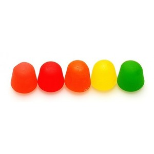

===

**dots**

These are my dots, with them I am decently pleased.

Enormous kudos for this selection goes to tons of different resources for configuring various toolsets, but an especial "thank you" to [elenapan/dotfiles](https://github.com/elenapan/dotfiles) both for serving as an excellent reference point and for being the original code source for much of the `awesomewm` theme work.

The main difference between my own awesomewm setup and many of the examples it's based on is the support for multiple displays (or screens); specifically, splitting the global tag set to span displays so I can more easily map application groups to their desired tag/display. This stems from my normal setup which is to have a primary external display alongside a docked laptop, I tend to utilize the laptop for music and widget or sys info type applications, while the tag set for my primary display is dedicated to work / chat / browsing apps.

**installation**

```
git clone --recurse-submodules git@github.com:unboundev/dots ~/dots

ln -sf ~/dots/xinitrc ~/.xinitrc
ln -s ~/.xinitrc ~/.xsession

ln -sf ~/dots/tmux-conf/.tmux.conf ~/.tmux.conf
ln -sf ~/dots/tmux.conf.local ~/.tmux.conf.local

ln -sf ~/dots/config/nvim ~/.config/nvim
ln -sf ~/dots/config/wpg/sequences ~/.config/wpg/sequences
ln -sf ~/dots/cargo/config ~/.cargo/config
ln -sf ~/dots/Xauthority ~/.Xauthority
ln -sf ~/dots/Xresources ~/.Xresources
ln -sf ~/dots/gitconfig ~/.gitconfig
ln -sf ~/dots/zshrc ~/.zshrc

ln -sf ~/dots/config/awesome ~/.config/awesome
ln -sf ~/dots/config/fontconfig/fonts.conf ~/.config/fontconfig/fonts.conf
```
